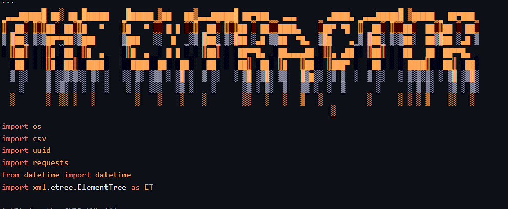

# The Extractor (GHDB)

The Extractor is a Python script that extracts Google dorks from the official Google Hacking Database (GHDB) and saves them in various file formats, including CSV, XML, TXT, and SQLite. The script only extracts dorks that contain the "inurl:" operator because they are more specific and useful for targeted web scanning.

**Warning: The Extractor script is intended for educational and ethical purposes only. The extracted dorks should only be used for ethical hacking and web security testing. The authors of The Extractor do not condone illegal activities and are not responsible for any misuse of the extracted dorks. Always use the extracted dorks responsibly and in accordance with the law.**

## Prerequisites
The script has been tested on Linux/Unix Bash-installed systems.
- Python 3.x
- requests module (you can install it via pip: pip install requests)
- CSV module (built-in module in Python)
- uuid module (built-in module in Python)
## Usage
- Download the GHDB XML file from the official GHDB repository: https://gitlab.com/exploit-database/exploitdb/-/tree/main/
- Save the file in the same directory as the Python script.
## Run the script:
```shell
python extractor.py [options] <filename>
```
or

```shell
python3 extractor.py [options] <filename>
```
### The available options are:

- -xml: Export data in a .xml-file
- -csv: Export data in a .csv-file
- -txt: Export data in a .txt-file
- -sqlite: Export data to a SQLite database

The <filename> argument is optional and specifies the name of the output file. If not provided, the default name extractor_data will be used.

- The script will check if an Internet connection is available. If yes, it will download the latest GHDB XML file. If no, it will use the local file (if available) or ask if you want to create a local copy of the GHDB XML file.
- The script will extract the dorks and save them in the specified output format (CSV by default) in the same directory as the script.
## Note
- The Extractor script only extracts dorks that contain the "inurl:" operator because they are more specific and useful for targeted web scanning.
## Disclaimer
The authors of The Extractor do not condone illegal activities and are not responsible for any misuse of the extracted dorks. Always use the extracted dorks responsibly and in accordance with the law.
## Copyright
S. Volkan Kücükbudak
## License
This project is licensed under the MIT - see the [LICENSE](LICENSE) file for details.
